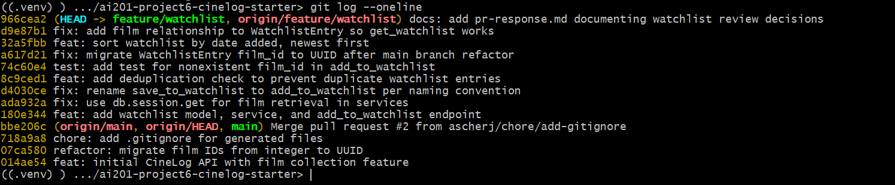

# PR Response Doc — CineLog Watchlist Feature


## AI Usage
One specific way that AI was used throughout this was to help understand the logic and structure of test/test_collection.py. Understanding the logic and structure of this was extremely important because it would be the baseline for building test/test_watchlist.py. So without understanding what imports, and how to define the app and fake user/film I would not be able to replicate it for the new testing file. I also had it play devils advocate on comment 4 with it explaining that it made it more of an active effort for users to need to allow their watchlist to be public instead of having it automatically being so. However, I still think that it is more costly to have user data automatically publically available than making it so that the user must manually make it public. 

## Comment 1 — Rename
**What I did:** I had first identified where the function save_to_watchlist() was made and also where it was referenced/used in other functions and files. Following this I had changed the name from save_to_watchlist() to add_to_watchlist() whereever it was referenced. 
**How I verified:** I was able to verify that the change worked and didn't create any bugs by searching the entire repo for the old name save_to_watchlist() and confirmed it no longer existed. Later on I went onto test that there weren't any bugs through test_watchlist.py. 

## Comment 2 — Deduplication
**What I did:** I first has looked at add_to_collection() to confirm how the deduplication logic fucntioned. Understanding that I needed to filter through WatchlistEntry to ensure that no matching film existed already for that user. Then if it was true I would need to raise an AlreadyInWatchlistError. Seeing that it didn't exist I then created a AlreadyInWatchlistError class to be called. 
**How I verified:** I verified by constantly comparing the add_to_watchlist() to add_to_collection() to ensure that the logic they both followed was the same. I then later tested it with the test_watchlist.py to ensure there were no bugs. 

## Comment 3 — Missing test
**What I did:** I first had created test/test_watchlist.py. Following this I went and looked at test/test_collection.py to see how it was structured. Following this I copied the general structure of test/test_collection.py for test/test_watchlist.py but made any changes that would be needed to make it specialized for the watchlist model. After this I looked at test_add_to_collection_nonexistent_film_raises() and used its logic to build the test_add_to_watchlist_nonexistent_film_raises(). 
**How I verified:** I tested this by once again checking the logic between test_add_to_collection_nonexistent_film_raises() and test_add_to_watchlist_nonexistent_film_raises() to make sure that they match. Then I ran the test/test_watchlist.py to see if there were any errors with compiling. Lastly, I ran the test to see that I had worked and produced a proper result. 

## Comment 4 — Default visibility
**My position:** I believe that it should be changed into public = False.
**Reasoning:** Instead of having the users watchlist be publicized automatically they should have the choice to make it public. A watchlist is personal user data and therefore should be automatically protected, so making public = False creates a safer default for user data. If users then would like to make their watchlist public then that should be their deliberate choice rather than the default. It is better to force users into having to click that extra opt-in than accidentally over-share user data. 
**Tradeoff acknowledged:** This does mean that if you want to share your watchlist with other users you would need to take an explicit action. However, this is a small and simple choice that can be taken instead of having the baseline be that user information is automatically public. 

## Comment 5 — Sort order
**My position:** I agree that it should be done in date order instead of alphabetical and will make that change. 
**Reasoning:** For a watchlist if you are going through it the most recent things that you have added currently best match your preference in what you like to enjoy. People's tastes change overtime and so by having it be in date order it makes it so that when they go to their watchlist they are going to see the films that are most relavent to their current preference/tastes in film. 
**Engagement with reviewer's point:** I agree that users will likely want to see what they most recently added. It matches their current preferences are and makes it so that they are more likely to watch the film in that watchlist. Alphabetical order could lead to any films that they want to watch and just added to the watchlist gets lost or placed far down in the list, making it annoying for users as they'll then need to search for that specific film instead of simply having it already available at the top of the list. I think that alphabetic sort could still be useful but as a user-selectable sort option later, while having the data-added sort as the default.

## Comment 6 — Rebase
**What conflicted:** After I fetched origin and ran the rebase onto main, the only conflict was in models.py. The main branch had migrated film IDs from integer to UUID, so Film.id and CollectionEntry.film_id had both been changed to String(36). My branch had added a new WatchlistEntry model that still used an integer for film_id, so the two versions disagreed on how film_id should be stored. There was also a small hiccup where an untracked local .gitignore collided with the one main had added, so I removed my local copy since main's version already covered everything mine did.
**How I resolved it:** I kept my WatchlistEntry model but updated its film_id to be a String(36) UUID with the same foreign key, so that it matched how the rest of the models on main now referenced films. I then went and fixed the other spots in the watchlist code that still described film_id as an integer, which were the docstring in add_to_watchlist() and the comment in the add route. The test was already using a UUID string so it didn't need any changes, and my earlier changes from Comments 4 and 5 stayed intact through the rebase.
**How I verified no conflict remains:** I first searched the code to confirm there were no leftover conflict markers anywhere. I then checked the branch history and confirmed there were no merge commits and that main was a direct ancestor of my branch, meaning the history is linear and sits cleanly on top of main. Lastly I ran the test suite again and all of the tests passed, which confirmed the watchlist code still works correctly against the new UUID schema.

## PR Description

### What this feature does
This PR adds a watchlist to CineLog, which is a list of films that a user wants to watch later. It is separate from their collection, which is for films they have already watched. To do this I added a WatchlistEntry model that keeps track of the user, the film, the date it was added, and whether it is public. I also added two endpoints: POST /watchlist/<user_id>/add to add a film to a user's watchlist, and GET /watchlist/<user_id> to view it. The logic lives in a watchlist service with add_to_watchlist() and get_watchlist(). I also made it so that adding a film that doesn't exist raises a FilmNotFoundError and adding a film that is already saved raises an AlreadyInWatchlistError, so the same film can't be added twice.

### Design decisions I made
**Visibility default:** I decided to make the watchlist default to private (public=False) instead of public. My reasoning is that a watchlist is personal user data, so I think it should be protected automatically. If a user wants to share their watchlist then that should be their own deliberate choice rather than the default. It felt better to make users opt in to sharing than to accidentally over-share their information.

**Sort order:** I decided to sort the watchlist by the date added with the newest first, instead of alphabetically by title. I think the films someone most recently added are the ones that best match what they currently want to watch, so it makes more sense to show those at the top. With alphabetical order a film they just added could get buried far down the list, which would be annoying. I think alphabetical could still be added later as an optional sort, but date added felt like the better default.

### How to manually test it
1. First install the dependencies and start the app:
   ```
   pip install -r requirements.txt
   python app.py
   ```
2. Next you need a user and a film to work with. There isn't a seed or admin endpoint, so I used the Flask shell to make them and grab their IDs:
   ```
   flask --app app shell
   >>> from app import db
   >>> from models import User, Film
   >>> u = User(username="alice", email="alice@example.com")
   >>> f = Film(title="Paddington 2", year=2017, genre="Comedy")
   >>> db.session.add_all([u, f]); db.session.commit()
   >>> print(u.id, f.id)   # copy these two UUIDs
   ```
3. Then add the film to the watchlist. You should get back a 201 and the entry as JSON with "public": false:
   ```
   curl -X POST http://127.0.0.1:5000/watchlist/<user_id>/add \
     -H "Content-Type: application/json" -d "{\"film_id\": \"<film_id>\"}"
   ```
4. To check the dedup, add the same film again and you should see the AlreadyInWatchlistError.
5. To check the not-found case, add a film_id that doesn't exist and you should see the FilmNotFoundError.
6. Finally view the watchlist and confirm the film you added most recently shows up first:
   ```
   curl http://127.0.0.1:5000/watchlist/<user_id>
   ```